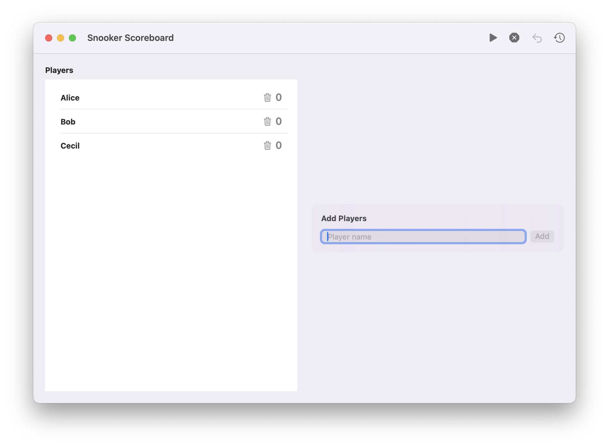
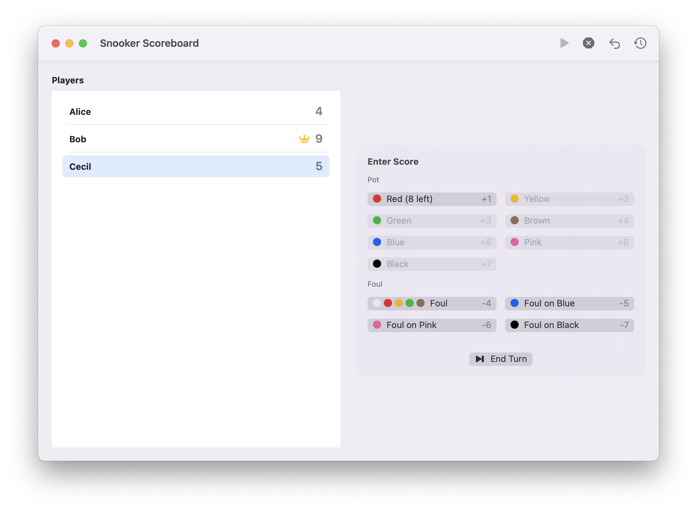
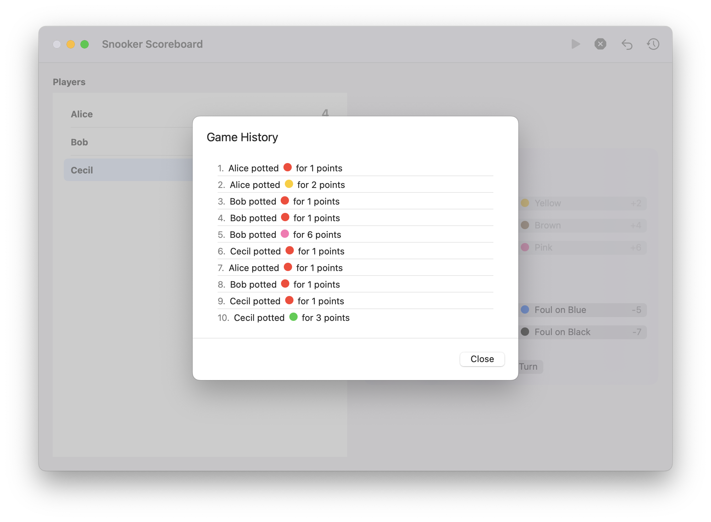

# Snooker Scoreboard (macOS)

Native macOS scoreboard for casual snooker sessions. Add players, track pots and fouls, undo mistakes, and keep the current leader crowned. The app includes rule‑aware scoring and game history, with a lightweight SwiftUI interface.

## Features
- Add and remove players before a game starts
- Start a game with turn highlighting and leader crown
- Pot scoring and foul scoring with undo support
- End‑turn control plus automatic turn advance on fouls
- Game history dialog
- Optional rule enforcement (reds/colours alternation and final colour sequence)
- Automatic game end with a final score dialog when rules are enforced

## Game Options (Menu Bar)
- Foul points awarded to: next player or all players
- Enforce snooker rules (disables illegal pots and fouls)

## UI Preview

### New Game

### In‑game Scoring

### Game History

